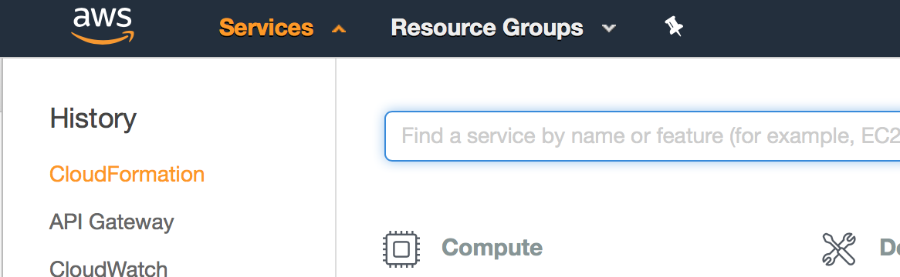
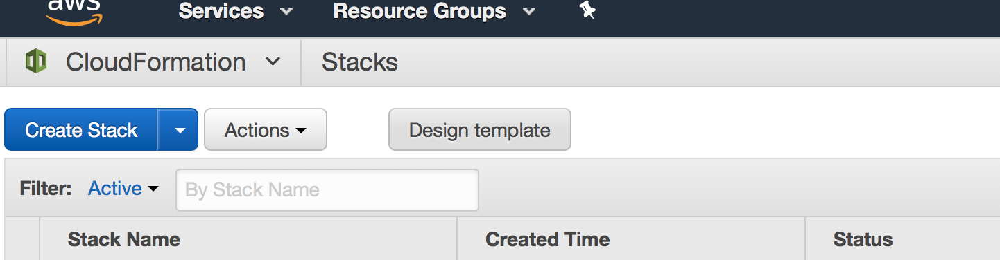
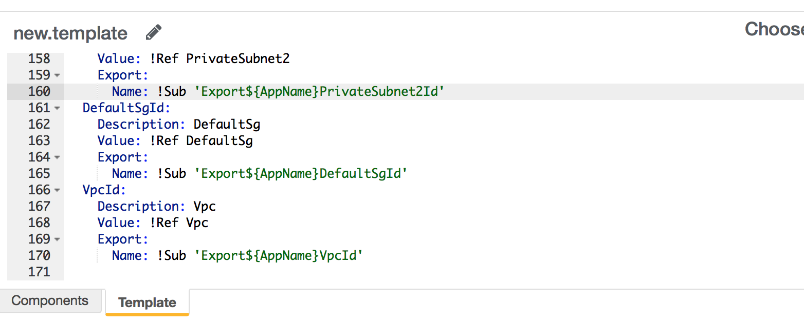
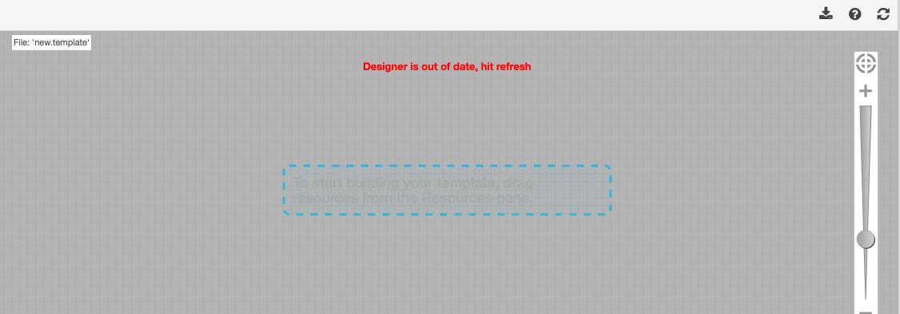
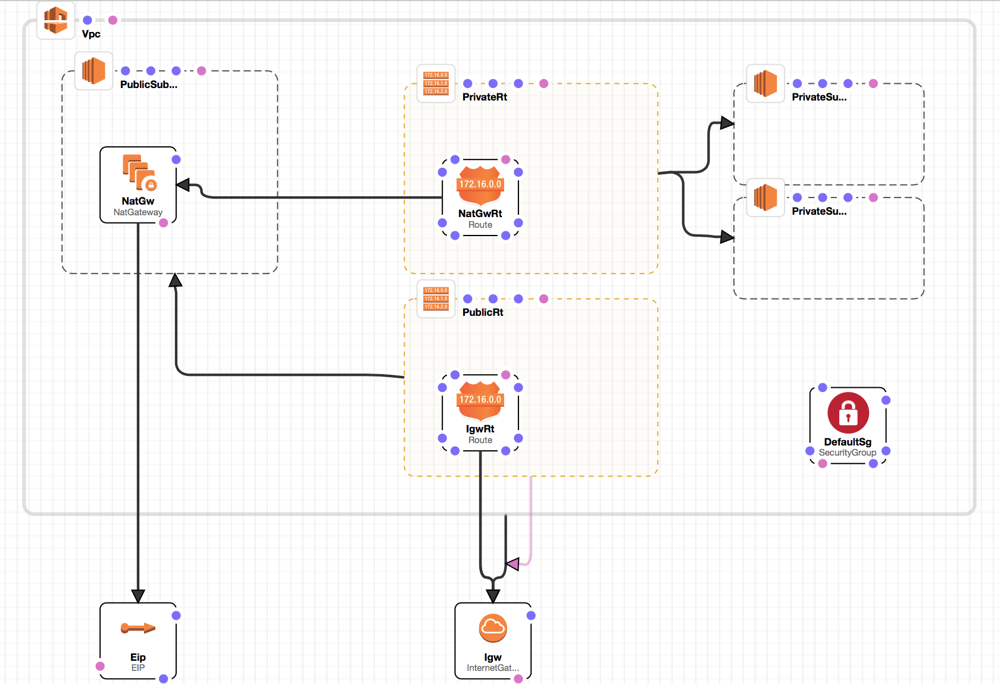

# stacks/vpc.yaml

- AWS의 가상 네트워크를 관리하는 기본적인 템플릿 입니다.
- 구성요소
    - VPC
        - AWS의 가상 네트워크입니다. IP 범위를 지정합니다.  
        - https://docs.aws.amazon.com/ko_kr/AmazonVPC/latest/UserGuide/VPC_Introduction.html 
    - Subnet
        - VPC 내에서 분리해서 IP 주소의 범위 지정합니다.
        - https://docs.aws.amazon.com/ko_kr/AmazonVPC/latest/UserGuide/VPC_Introduction.html
    - RouteTable
        - Subnet에 대한 라우팅을 제어합니다.
        - https://docs.aws.amazon.com/ko_kr/AmazonVPC/latest/UserGuide/VPC_Route_Tables.html
    - InternetGateway
        - VPC에 연결해서 인터넷을 할 수 있게 해줍니다.
        - https://docs.aws.amazon.com/ko_kr/AmazonVPC/latest/UserGuide/VPC_Internet_Gateway.html
    - EIP
        - VPC에 연결 가능한 Public IP.
        - https://docs.aws.amazon.com/ko_kr/AmazonVPC/latest/UserGuide/vpc-eips.html
    - SecurityGroup
        - Inbound / Outbound 보안 규칙을 지정합니다.
        - https://docs.aws.amazon.com/ko_kr/AmazonVPC/latest/UserGuide/VPC_SecurityGroups.html
    - NatGateway
        - Subnet의 Private IP를 Public IP로 변환하는 용도로 사용합니다.
        - https://docs.aws.amazon.com/ko_kr/AmazonVPC/latest/UserGuide/vpc-nat-gateway.html

아래와 같이 네트워크를 구성하는게 목표입니다.

<https://docs.aws.amazon.com/ko_kr/AmazonVPC/latest/UserGuide/vpc-nat-gateway.html>

CloudFormation Designer로 vpc.yaml의 실제 구성을 확인해 보겠습니다.
1. cloudformation 콘솔로 들어갑니다.

2. 좌측 상단의 Design template 클릭

3. 좌측 하단의 Template 탭에서 vpc.yaml의 내용을 붙여넣습니다.

4. Designer meta data가 없어서 인식 하지 못합니다. 우측 상단의 리프레시 버튼을 클릭하면 콘솔에서 자동으로 meta data를 넣습니다.

Designer에 템플릿 정보가 나오면 자유롭게 위치를 이동하거나 정보를 변경할 수 있습니다.
